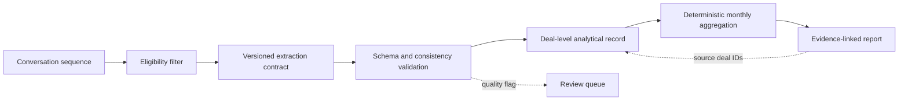

# System design and evidence index

## Architecture



The LLM boundary ends at the structured deal record. Percentages, denominators, period
comparisons and report tables are calculated in deterministic Python code.

## Evidence index

| Engineering property | Repository artifact | Verification |
|---|---|---|
| Strict structured output | [`deal_analysis.schema.json`](../schemas/deal_analysis.schema.json) | `ci-lab validate` rejects incomplete or contradictory records |
| Complete deal sequence | [`synthetic_deals.jsonl`](../data/synthetic_deals.jsonl) | fixtures include multi-call deals and explicit outcomes |
| Traceable aggregates | [`sample-report.md`](../examples/sample-report.md) | monthly indicators retain their source deal IDs |
| Explicit denominators | [`report.py`](../src/ci_lab/report.py) | rates are calculated from named eligible populations |
| Regression protection | [`tests/`](../tests/) | deterministic tests cover validation, denominators and direction of change |
| Causal boundary | [`sample-report.md`](../examples/sample-report.md) | observations are separated from business hypotheses |

## Reproduce the release surface

```bash
python -m pip install -e .
ci-lab validate data/synthetic_deals.jsonl
ci-lab report data/synthetic_deals.jsonl --output report.md
python -m unittest discover -s tests -v
```

The generated report and the checked-in sample use the same CLI path. No model API or external
service is required to verify the analytical layer.
